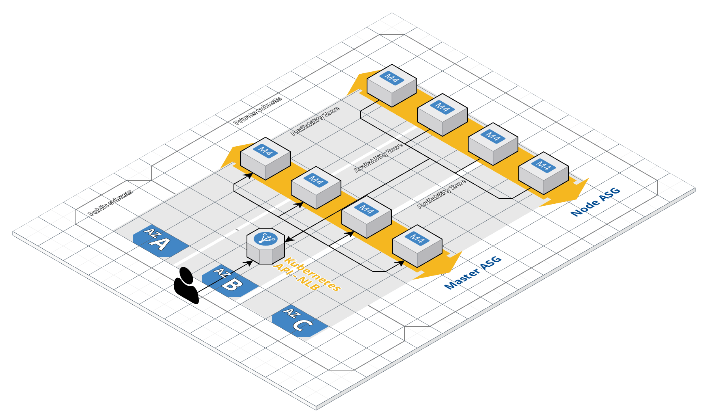

# Deploying on AWS

Symplegma supports AWS as a cloud provider.

## Architecture

`contrib/aws/` contains terraform file to deploy the following architecture. This is strongly opinionated and deploys the following architecture:



For now, each cluster has its own VPC, subnets, NAT etc. VPC module is included inside the symplegma module, this is subject to change in the future as PR are welcomed to make the possibilities evolved and split modules.

## Requirements

* [Terraform](https://www.terraform.io/intro/getting-started/install.html)
* [Terragrunt](https://github.com/gruntwork-io/terragrunt#install-terragrunt)
* [Ansible](https://docs.ansible.com/ansible/2.7/installation_guide/intro_installation.html)
* [kubectl](https://kubernetes.io/docs/tasks/tools/install-kubectl/)

## Terraform and Terragrunt

Terragrunt is used to enable multiple cluster and environments, also to enable remote state storage and locking with Terraform.

Terraform remote state is stored in an encrypted S3 bucket and state locking is done with AWS DynamoDB.

### Terragrunt modules

Symplegma is packaged in a [Terragrunt module](https://github.com/gruntwork-io/terragrunt) available [here](https://github.com/clusterfrak-dynamics/symplegma/tree/master/contrib/aws/terraform).

### Terragrunt variables

Remote state specific variables:

```
{!contrib/aws/terraform/env/terraform.tfvars!}
```

Cluster specific variables:

```
{!contrib/aws/terraform/env/sample/symplegma/terraform.tfvars!}
```

## Creating the infrastructure

To init a new AWS cluster, simply run `./script/init-aws.sh $CLUSTER_NAME`

It will generate `inventory/aws/$CLUSTER_NAME` with the following directory structure:

```
.
├── sample
│   ├── aws.py -> ../../../contrib/aws/inventory/aws.py
│   ├── group_vars
│   │   └── all
│   │       └── all.yml
│   ├── host_vars
│   └── tf_module_symplegma
│       └── terraform.tfvars
└── terraform.tfvars
```

### Customizing the infrastructure

Terraform variable files come with sensible default for the `eu-west-1` region.

If you wish to change remote state configuration you can edit `$CLUSTER_NAME/terraform.tfvars`

If you wish to customize the infrastructure you can edit `$CLUSTER_NAME/tf_module_symplegma/terraform.tfvars`

One of the most important variable is `cluster_name` that allows you tu use AWS dynamic inventory with multiple cluster. We recommend this variables to be coherent throughout your files and equals to `$CLUSTER_NAME` defined earlier.

There is also a set of sensible default tags that you can customize such as `Environment` for example or add your own.

To avoid bloating the configuration files and unnecessary hard coded values, Terraform provider credentials are derived from your AWS SDK config. Make sure you are using the correct aws profile by setting your `AWS_PROFILE` environment variable.

### Initializing the infrastructure

Once everything is configured to your needs, just run:

```
terragrunt apply-all --terragrunt-source-update
```

Couples minute later you should see your instances spawning in your EC2 dashboard.

## Deploying Kubernetes with symplegma playbooks

### AWS Dynamic inventory

AWS dynamic inventory allows you to target a specific set of instances depending on the `$CLUSTER_NAME` you set earlier. You can configure the behavior of dynamic inventory by setting the following `ENV`:

* `export SYMPLEGMA_CLUSTER=$CLUSTER_NAME` : Target only instances belonging to this cluster.
* `export SYMPLEGMA_AWS_REGION=eu-west-1` : AWS region where instances are targeted.

To test the behavior of the dynamic inventory just run:

```
./inventory/aws/$CLUSTER_NAME/aws.py --list
```

It should only return a specific subset of your instances.